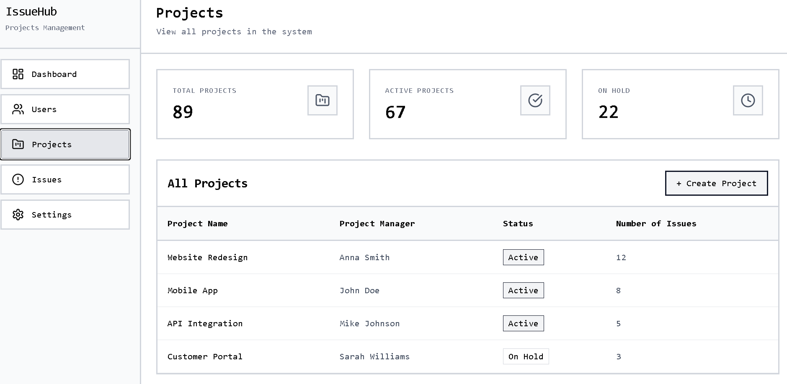

Week 4

User stories report pt2. Developer role- Gledis 
1.View Assigned Issues
*As a developer, I want to see a list of issues assigned to me, so that I can easily track the tasks I need to work on.
*As a developer, I want to open an issue to view its full details, so that I understand the task requirements before starting to work.
*As a developer, I want to filter my assigned issues by status or priority, so that I can quickly focus on what matters most.
2.Update Issue Status
*As a developer, I want to update the status of an issue, so that the team can track the progress of my work.
*As a developer, I want to see a full history of status changes for an issue, so that  I can understand how the task has evolved over time.
*As a developer, I want to add a short note when changing an issue's status, so that my teammates understand the reason for the change.
3.Add Comments
*As a developer, I want to add comments to an issue, so that I can share updates or ask questions related to the task.
*As a developer, I want to edit or delete my own comments, so that I can correct or update the information I provided.
*As a developer, I want to mention a teammate in a comment using @username, so that they are notified about relevant information.
4.Add Attachments
*As a developer, I want to upload files to an issue, so that I can provide supporting materials such as screenshots or documents.
*As a developer, I want to view and download attachments on an issue, so that I can access all files related to the task.
*As a developer, I want to see preview of image attachments inline, so that I do not have to download them just so check their content.
5.Track Personal Tasks
*As a developer, I want to see my tasks organised by deadline or priority, so that I can plan my work efficiently.
*As a developer, I want to see which tasks are overdue or completed, so that I can track my progress and meet deadlines.
*As a developer, I want to recieve in-app notifications when a new issue is assigned to me, so that I am immediately aware of new responsibilities.
6.Search and Filter Issues
*As a developer, I want to search issues by keyword across all projects I am part of, so that I can quickly find relevant work items.
*As a developer, I want to filter issues by label, or date range, so that I can narrow down the list to what I need.

Use case document-Gledis
1.Log-in to IssueHub
*Use Case ID: UC-01 
*Use Case Name: Log In to IssueHub
*Actor: Developer
*Description: The developer authenticates with their email and password to access the system. *Preconditions: The developer has a registered and active account created by the system administrator.
*Main Flow: 1. Developer navigates to the IssueHub login page. 2. Developer enters their email and password. 3. System validates the credentials. 4. System redirects the developer to their personal dashboard. 
*Alternative Flows: 3a. Credentials are invalid → system shows an error message; developer may retry. 3b. Account is deactivated → system shows 'Account disabled' and blocks access. *Postconditions: Developer is authenticated and can access all features available to their role. 
*Restrictions: Maximum 5 failed login attempts triggers a 15-minute account lockout.
2.View Assigned Issues
*Use Case ID: UC-02 
*Use Case Name: View Assigned Issues
*Actor: Developer 
*Description: The developer views and filters the list of issues assigned to them. 
*Preconditions Developer is logged in and has at least one issue assigned to them. 
*Main Flow 1. Developer navigates to 'My Issues' from the dashboard. 2. System displays all issues assigned to the developer. 3. Developer optionally applies filters (status, priority, due date). 4. Developer clicks an issue to view its full details. 
*Alternative Flows 2a. No issues are assigned → system shows an empty-state message. 3a. Filter returns no results → system shows 'No issues match your filters'.
*Postconditions Developer has a clear view of their workload and can open any issue for details. 
*Restrictions Developers can only see issues from projects they are members of.
3.Update Issue Status
*Use Case ID: UC-03 
*Use Case Name: Update Issue Status
*Actor: Developer 
*Description: The developer changes the status of an assigned issue to reflect current progress. *Preconditions: Developer is logged in. The issue is assigned to them and is not archived.
*Main Flow 1. Developer opens the issue detail page. 2. Clicks the current status badge to open the status dropdown. 3. Selects the new status (e.g. In Progress, Blocked, Done). 4. Optionally types a transition note explaining the change. 5. Clicks 'Confirm'. System saves the change and logs it in the issue history. 
*Alternative Flows 3a. Developer selects 'Done' but sub-tasks are still open → system warns and requires confirmation. 5a. Network error occurs → system shows an error and the status remains unchanged. 
*Postconditions Issue status is updated; the change appears in the history log; the project manager is notified. 
*Restrictions Developers may only update statuses on issues assigned to them. Archived issues are read-only.
4.Add a Comment to an Issue
*Use Case ID: UC-04 
*Use Case Name: Add a Comment to an Issue 
*Actor: Developer 
*Description: The developer adds a comment to an issue to share progress or ask a question. Preconditions Developer is logged in and has read access to the issue. 
*Main Flow 1. Developer opens the issue detail page. 2. Scrolls to the Comments section. 3. Types a comment (supports @mentions and basic Markdown formatting). 4. Clicks 'Post Comment'. 5. System saves and displays the comment with a timestamp.
*Alternative Flows 3a. Comment body is empty → 'Post' button remains disabled. 3b. @mentioned user does not exist → mention renders as plain text with a warning. 
*Postconditions Comment is visible to all project members. @mentioned users receive a notification. 
*Restrictions Comments are limited to 5,000 characters. Developers may only edit or delete their own comments.
5.Upload Attachment to an Issue
*Use Case ID: UC-05 
*Use Case Name: Upload Attachment to an Issue 
*Actor: Developer 
*Description: The developer uploads a file to an issue to provide supporting context. *Preconditions Developer is logged in. The issue exists and is not archived. 
*Main Flow 1. Developer opens the issue detail page. 2. Clicks 'Add Attachment'. 3. Selects a file from their device. 4. System validates the file size and type, then uploads it. 5. File appears in the Attachments section with a preview (images) or download link. 
*Alternative Flows 4a. File exceeds 10 MB → system rejects the upload and shows a size error. 4b. File type is not allowed (e.g. .exe) → system rejects and shows a type error. 4c. Upload interrupted → system shows a retry option. 
*Postconditions Attachment is stored and linked to the issue. All project members can view or download it. 
*Restrictions Allowed types: .jpg, .png, .gif, .pdf, .doc, .docx, .xls, .xlsx, .zip, .txt. Max 10 MB per file.
6.Track Personal Tasks
*Use Case ID: UC-06 
*Use Case Name: Track Personal Tasks Actor Developer 
*Description: The developer reviews their personal task overview to manage deadlines and priorities. 
*Preconditions: Developer is logged in. 
*Main Flow 1. Developer opens the 'My Tasks' dashboard section. 2. System displays tasks grouped by: Overdue, Due Today, Upcoming, Completed. 3. Developer sorts or filters by priority or project. 4. Developer clicks a task to open its issue detail page. 
*Alternative Flows 2a. No tasks exist → system shows an empty-state with a prompt to check with the project manager. 
*Postconditions Developer has a clear, prioritised view of all their pending and completed work. *Restrictions Only issues assigned to the logged-in developer are shown. Completed tasks are visible for 30 days
7.Search and Filter Issues
*Use Case ID: UC-07
*Use Case Name: Search and Filter Issues
*Actor: Developer
*Description:The developer searches for issues by keyword or applies filters to find specific
work items.
*Preconditions:Developer is logged in and is a member of at least one project.
*Main Flow: 1.. Developer clicks the search bar at the top of the page. 2. Types a keyword
(title, description, or issue ID). 3. System returns matching issues from
projects the developer is part of. 4. Developer optionally applies additional
filters (label, date range, status). 5. Developer clicks a result to open the issue.
*Alternative Flows: 3a. No results found → system shows 'No issues match your search'. 2a.
Search query is less than 2 characters → system does not trigger a search.
*Postconditions: Developer is taken to the selected issue's detail page.
*Restrictions:Search only covers projects the developer is a member of. Results are limited
to 50 per page.

---

## System Administrator

### Projects Tab - Klevi

This screen represents the Projects tab for the System Administrator, providing a high-level overview of all projects, including project managers, status, and number of issues.

### UI Screenshot

---

## Use Case: System Administrator

This use case describes how the System Administrator interacts with IssueHub to manage users, roles, system settings, and monitor the platform.

### Actor
System Administrator

### Goal
To control access, configure the system, and monitor all projects and issues.

### Preconditions
- Admin account exists  
- Admin is logged into the system  

### Main Flow
1. Admin logs into IssueHub  
2. Admin accesses the dashboard  
3. Admin performs actions such as:
   - create/edit/delete users  
   - assign roles  
   - view all projects and issues  
   - configure system settings  
4. System saves changes and confirms actions  

### Alternative Flows
- Invalid login → access denied  
- Duplicate user → error message  
- Invalid role → system rejects action  

### Postconditions
- Users and roles are updated  
- System settings are saved  
- System data remains consistent  

### Restrictions / Constraints
- Only admins can access these features  
- User emails must be unique  
- Roles must be valid  
- Admin actions must follow system rules  

### Outcome
The System Administrator successfully manages and monitors the entire IssueHub system.

--------------------------------------------------------------------------------------------------------------------
# Project Management Platform — User Stories

## Role: Project Manager --Xhoana Thano

   
---

# 1. Project Setup & Organization

## US-01 | Create Project
**User Story:**  
As a Project Manager, I want to create a new project with a name, description, start date, end date, and project type, so that I can establish a structured workspace for my team to collaborate within.

**Acceptance Criteria:**
- PM can define project name, description, goals, and timeline  
- PM can set project visibility (private / team / organization)  
- PM can select a project template (Scrum, Kanban, Waterfall)  
- A unique project ID is auto-generated upon creation  

---

## US-02 | Add Team Members
**User Story:**  
As a Project Manager, I want to add team members to a project and assign them roles, so that each person has the appropriate access and responsibilities defined from the start.

**Acceptance Criteria:**
- PM can search and invite members by name or email  
- PM can assign roles: Developer, Designer, QA, Viewer, Co-Manager  
- PM can remove or change member roles at any time  
- Invited members receive a notification  

---

## US-03 | Manage Team Availability & Capacity
**User Story:**  
As a Project Manager, I want to see each team member's availability, declared work hours, and current task load, so that I can make informed decisions when assigning work.

**Acceptance Criteria:**
- Each member has a visible weekly hour capacity  
- The system shows hours allocated vs. remaining  
- PM is warned when a member is at or above 100% capacity  
- Capacity view is accessible from dashboard and task assignment panel  

---

# 2. Task Management

## US-04 | Create Tasks
**User Story:**  
As a Project Manager, I want to create tasks with a title, description, type, and acceptance criteria, so that each unit of work is clearly defined and trackable.

**Acceptance Criteria:**
- Task types: Feature, Bug, Improvement, Research, Meeting Action  
- PM can add subtasks, checklists, and attachments  
- Tasks linked to project, sprint, or milestone  
- Unique task ID auto-generated (e.g., PROJ-042)  

---

## US-05 | Assign Tasks
**User Story:**  
As a Project Manager, I want to assign tasks to one or more team members, so that responsibilities are clearly defined.

**Acceptance Criteria:**
- Single or multiple assignees per task  
- Notifications sent (in-app & email)  
- Tasks can be reassigned anytime  
- Warning if assignment exceeds capacity  

---

## US-06 | Set Task Priority
**User Story:**  
As a Project Manager, I want to set priority levels on tasks, so that the team knows what to work on first.

**Acceptance Criteria:**
- Priority levels: Critical, High, Medium, Low  
- Color-coded priorities  
- Bulk update supported  
- Sort and filter by priority  

---

## US-07 | Set Deadlines & Milestones
**User Story:**  
As a Project Manager, I want to define due dates and milestones, so that the project stays on schedule.

**Acceptance Criteria:**
- Start and due dates per task  
- Milestones group multiple tasks  
- Tasks near deadline (48h) highlighted  
- Overdue tasks flagged in red  

---

## US-08 | Link & Depend Tasks
**User Story:**  
As a Project Manager, I want to define dependencies between tasks, so that the correct execution order is clear.

**Acceptance Criteria:**
- Dependency types: Blocks, Blocked By, Relates To, Duplicates  
- Blocked tasks cannot move to "In Progress" without override  
- Dependency chains visible in timeline/Gantt  

---

# 3. AI-Powered Meeting & Audio Features

## US-09 | Generate Tasks from Meeting Audio
**User Story:**  
As a Project Manager, I want to upload or record meeting audio and extract action items automatically.

**Acceptance Criteria:**
- Upload (MP3, WAV, M4A) or record audio  
- Speech-to-text transcription  
- AI extracts action items, owners, priorities  
- PM reviews and confirms tasks  
- Audio and transcript stored  

---

## US-10 | Generate Tasks from Meeting Transcript
**User Story:**  
As a Project Manager, I want to upload or paste transcripts to generate tasks.

**Acceptance Criteria:**
- Upload .txt / .docx or paste text  
- AI detects action items, owners, deadlines  
- PM can approve/edit suggestions  
- Transcript stored in project  

---

## US-11 | Summarize Meeting & Log Decisions
**User Story:**  
As a Project Manager, I want automatic meeting summaries.

**Acceptance Criteria:**
- Summary includes:
  - Decisions Made  
  - Risks Identified  
  - Tasks Created  
  - Next Meeting Points  
- Editable and shareable  
- Stored in meeting log  

---

# 4. Progress Tracking & Monitoring

## US-12 | Kanban Board
**User Story:**  
As a Project Manager, I want a Kanban board view to track progress.

**Acceptance Criteria:**
- Columns: Backlog, To Do, In Progress, In Review, Done  
- Drag-and-drop tasks  
- Customizable columns  
- Task cards show assignee, priority, due date, ID  

---

## US-13 | Timeline / Gantt View
**User Story:**  
As a Project Manager, I want a timeline view of tasks.

**Acceptance Criteria:**
- Tasks shown as horizontal bars  
- Dependencies visualized  
- Drag to adjust dates  
- Critical path highlighted  

---

## US-14 | Identify Delayed & At-Risk Tasks
**User Story:**  
As a Project Manager, I want to identify overdue and at-risk tasks.

**Acceptance Criteria:**
- Overdue tasks flagged red  
- No-progress tasks flagged "At Risk"  
- Daily digest sent to PM  
- Suggested corrective actions  

---

## US-15 | Monitor Team Workload
**User Story:**  
As a Project Manager, I want a workload view for team members.

**Acceptance Criteria:**
- Workload as percentage/bar  
- Colors:
  - Green (healthy)  
  - Yellow (approaching limit)  
  - Red (overloaded)  
- Drag tasks between members  
- Filter by sprint/date range  

---

# 5. Time, Budget & Billing

## US-16 | Log Billable Hours
**User Story:**  
As a Project Manager, I want to track billable hours.

**Acceptance Criteria:**
- Manual or timer-based logging  
- Mark billable/non-billable  
- Aggregation by task/member/project  
- Export CSV/PDF  

---

## US-17 | Monitor Budget & Limits
**User Story:**  
As a Project Manager, I want to track project budget usage.

**Acceptance Criteria:**
- Set total hours/cost budget  
- Alerts at 75% and 90%  
- Block task assignment when exceeded (override allowed)  
- Dashboard shows budget vs actual  

---

# 6. Communication & Collaboration

## US-18 | Comment on Tasks
**User Story:**  
As a Project Manager, I want to comment and tag members.

**Acceptance Criteria:**
- Rich text comments with attachments  
- @mentions trigger notifications  
- Threaded and timestamped comments  
- Mark comments as resolution/decision  

---

## US-19 | Announcements
**User Story:**  
As a Project Manager, I want to send project-wide announcements.

**Acceptance Criteria:**
- Compose announcements  
- Notify via app/email/push  
- Stored in notice board  

---

## US-20 | Notification Preferences
**User Story:**  
As a Project Manager, I want to control notifications.

**Acceptance Criteria:**
- Notification types:
  - Task assigned  
  - Comment added  
  - Deadline approaching  
  - Status changed  
  - Budget alert  
- Users control preferences  
- PM sets minimum project rules  

---------------------------------------------------------------------------------------------
# Edvin Mehaj
# 7. Reporting & Dashboard

## US-21 | Project Health Dashboard
**User Story:**  
As a Project Manager, I want a single dashboard that shows the overall health of my project, so that I can make fast, informed decisions without navigating multiple screens.

**Dashboard Indicators:**

| Indicator               | Status   |
|------------------------|----------|
| Deadline Risk          | ⚠ High   |
| Team Workload          | ⚠ Medium |
| Task Completion Rate   | ✓ Good   |
| Budget Consumption     | 68%      |
| Overall Project Health | 65%      |

**Acceptance Criteria:**
- Health score is calculated using:
  - Completion rate  
  - Overdue tasks  
  - Workload  
  - Budget status  
- Dashboard updates in real time  
- PM can drill down into each indicator  
- Suggested actions displayed:
  - "Reassign tasks to reduce overload"
  - "Extend deadline by 2 days"
  - "Add additional developer to task #54"

---

## US-22 | Generate Progress Reports
**User Story:**  
As a Project Manager, I want to generate weekly or on-demand progress reports, so that I can share project status with stakeholders without manual effort.

**Acceptance Criteria:**
- Reports include:
  - Tasks completed  
  - Tasks remaining  
  - Hours logged  
  - Budget used  
  - Risks  
- Exportable as PDF or shareable link  
- PM can schedule automatic weekly reports via email  

---

## US-23 | Sprint & Velocity Tracking
**User Story:**  
As a Project Manager, I want to plan sprints and track team velocity, so that I can improve estimation accuracy.

**Acceptance Criteria:**
- Create sprints with:
  - Start date  
  - End date  
  - Story point goal  
- Velocity chart shows completed points per sprint  
- Burndown chart shows remaining work vs. time  
- Unfinished tasks can be moved to next sprint with one click  

---

# 8. Integrations & Settings

## US-24 | Integrate with External Tools
**User Story:**  
As a Project Manager, I want to connect the platform with external tools, so that workflows are seamless.

**Acceptance Criteria:**
- Integrations include:
  - Slack  
  - Microsoft Teams  
  - Google Calendar  
  - GitHub  
  - GitLab  
  - Figma  
  - Google Drive  
- PM configures notification triggers  
- Two-way sync supported (e.g., GitHub commits linked to tasks)  

---

## US-25 | Project Settings & Permissions
**User Story:**  
As a Project Manager, I want full control over project settings and permissions, so that access is secure and appropriate.

**Acceptance Criteria:**
- Custom roles with permissions:
  - View  
  - Edit  
  - Comment  
  - Admin  
- PM can archive or delete projects  
- Export all project data anytime  
- Audit log tracks all changes  

---

# 🔄 Main Flow

## UC-07 — Generate Tasks from Meeting Audio
*(Related: US-09, US-10, US-11)*

**Flow:**
1. PM navigates to *Meetings* and selects **New Meeting Record**  
2. PM uploads audio and enters:
   - Title  
   - Date  
   - Attendees  
3. System transcribes audio  
4. PM reviews and edits transcript  
5. AI suggests tasks (assignee, priority, deadline)  
6. PM approves / edits / rejects suggestions  
7. Approved tasks created in backlog as *Meeting Action*  
8. System generates summary:
   - Decisions  
   - Risks  
   - Tasks  
   - Next Steps  
9. PM shares summary → team notified  

---

# 🔀 Alternative Flows

- **Record directly:** PM records audio in-browser → continues from transcription  
- **Approve all:** PM accepts all suggestions instantly  
- **Quick Extract:** Shortcut modal for fast task extraction without full meeting record  

---

